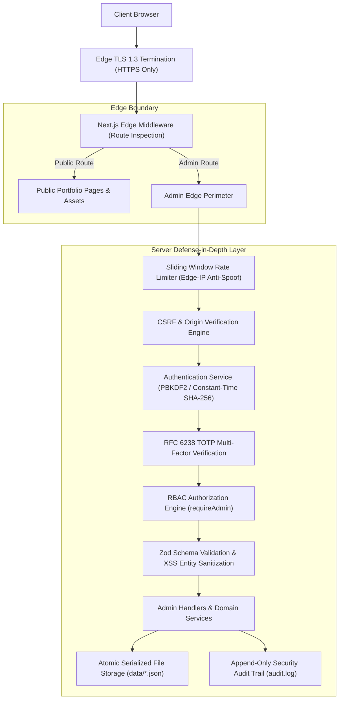

# Vipers.live — Production Admin Security Architecture

This document describes the defense-in-depth security architecture governing the administrative systems of **Vipers.live**.

---

## 1. Executive Summary & Security Boundary Model

The primary security premise of Vipers.live is that **the security boundary exists strictly on the server and edge runtime**. The system does not rely on hidden buttons, secret URLs, obscure ports, or client-side guards. Even if an adversary possesses full knowledge of the admin routes, framework internals, and frontend bundles, they cannot breach the system without valid cryptographic credentials, verified authorization, and Multi-Factor Authentication.



---

## 2. Authentication Architecture

### 2.1 Credential Verification
1. **PBKDF2-HMAC-SHA512 Password Hashing**:
   - 100,000 rounds of PBKDF2 with a unique 16-byte cryptographic salt per instance.
   - Evaluated using `crypto.timingSafeEqual` against the derived key buffer to prevent side-channel timing attacks.
2. **Backwards-Compatible Passkey Digestion**:
   - Direct passkeys are digested through SHA-256 before `timingSafeEqual` comparison, ensuring identical byte lengths and zero length-leakage.

### 2.2 Multi-Factor Authentication (MFA / TOTP)
- Standard RFC 6238 Time-Based One-Time Password algorithm.
- 160-bit Base32 secret keys (`generateTOTPSecret()`).
- 30-second time steps with ±1 window tolerance for clock drift.
- Dynamic truncation according to RFC 4226.
- One-time recovery backup codes.

---

## 3. Session Security & Revocation

### 3.1 Session Token Format
- Signed HMAC-SHA256 tamper-proof token: `<payloadBase64>.<signatureBase64>`.
- Payload contains:
  - `jti`: High-entropy UUID v4 (unique session identifier).
  - `userId`: Bound administrative user ID (`admin_primary`).
  - `role`: Cryptographically signed role (`admin`).
  - `iat`: Timestamp issued.
  - `exp`: Strict 8-hour expiration timestamp.

### 3.2 Cookie Parameters
| Attribute | Configuration | Security Benefit |
| :--- | :--- | :--- |
| **HttpOnly** | `true` | Inaccessible to client-side scripts; eliminates XSS session theft. |
| **Secure** | `true` (prod) | Transmitted exclusively over TLS encrypted connections. |
| **SameSite** | `Strict` | Withheld from cross-origin requests; eliminates CSRF exploitation. |
| **Path** | `/` | Confined to authorized application paths. |
| **Max-Age** | `28800` (8 hrs) | Automatic client-side session expiration. |

### 3.3 Server-Side Persistent Revocation
Upon logout, the session's `jti` is permanently registered in `data/revocations.json` via atomic disk writes. Even if an attacker steals an active cookie before expiration, the server immediately rejects the revoked `jti` on all future requests.

---

## 4. Role-Based Access Control (RBAC)

The server is the **sole source of truth** for roles and permissions:

```typescript
export type Role = "admin" | "editor" | "user";

export type Permission =
  | "READ_LEADS"
  | "DELETE_LEADS"
  | "UPDATE_SETTINGS"
  | "VIEW_AUDIT"
  | "MANAGE_USERS"
  | "SYSTEM_TELEMETRY";
```

* **`requireAdmin(request)`**: Validates HMAC signature, expiration, revocation, and role equality.
* Attempts to supply `role=admin` via request bodies, query strings, headers, or localStorage are completely ignored.

---

## 5. Admin Domain Evaluation (`admin.vipers.live` vs `/admin`)

| Factor | Path-Based (`vipers.live/admin`) | Subdomain (`admin.vipers.live`) |
| :--- | :--- | :--- |
| **Security Boundary** | High (Server Middleware + RBAC + MFA) | High (Server Middleware + RBAC + MFA) |
| **Cookie Isolation** | Isolated (`Path=/`) | Isolated (`Domain=admin.vipers.live`) |
| **Complexity** | Simple, unified deployment | Requires multi-domain routing, CORS handling |
| **Recommendation** | **Chosen Architecture** | Available as secondary DNS alias |

**Decision:** Path-based administration (`/admin`) combined with early edge middleware and server-side RBAC offers maximum security without introducing multi-domain certificate complexity or cross-origin session synchronization issues.

---

## 6. Audit Logging & Security Event Specifications

All security-relevant actions are recorded to `data/audit.log` as structured JSON Lines:

| Event Identifier | Description | Trigger Condition |
| :--- | :--- | :--- |
| `admin_login_success` | Successful admin authentication | Valid passkey + valid MFA |
| `admin_login_failed` | Failed authentication attempt | Invalid password or unknown user |
| `admin_mfa_success` | Verified TOTP code | Valid 6-digit TOTP token |
| `admin_mfa_failed` | Failed TOTP code | Invalid or expired token |
| `admin_lockout_triggered` | Brute-force lockout engaged | 5 consecutive login failures from IP |
| `admin_logout` | Clean administrative termination | Token added to revocation table |

*Automated 10 MB log rotation (`audit.log.1`) prevents disk exhaustion attacks (CWE-400).*

---

## 7. Incident Response Playbook

1. **Suspected Credential Leakage**:
   - Rotate `ADMIN_SECRET_KEY` and `SESSION_SECRET` in Vercel Environment Variables.
   - All active administrative sessions are instantly invalidated globally due to HMAC signature failure.
2. **Active Brute-Force Attack**:
   - Rate limiter automatically enforces a 15-minute lockout per IP after 5 attempts.
   - Check `data/audit.log` for offending IP addresses and block via Vercel Firewall / WAF rules.
3. **MFA Emergency Recovery**:
   - Use one of the 8 pre-generated one-time recovery codes to regain terminal access, then regenerate `ADMIN_MFA_SECRET`.
